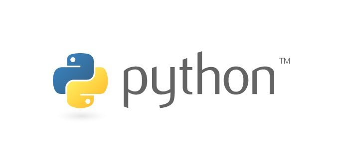

# Mini Python Projects

Hi everyone! I created this repository to store every mini projects I have done to practise Python language and keep track of my progress in programming.
Most of the projects will be using Jupyter Notebook. For the ideas, I get most of it from [Rohit Sharma's Article on UpGradblog](https://www.upgrad.com/blog/python-projects-ideas-topics-beginners/#3_Text-based_Adventure_Game). Do check it out because he included 42 Python projects idea categorised into Beginner, Intermediate, and Advanced Level.

## List of Python Projects in this repo
1. Python Simple Calculator [Intermediate]
2. Student Average Exam Scores [Beginner]
